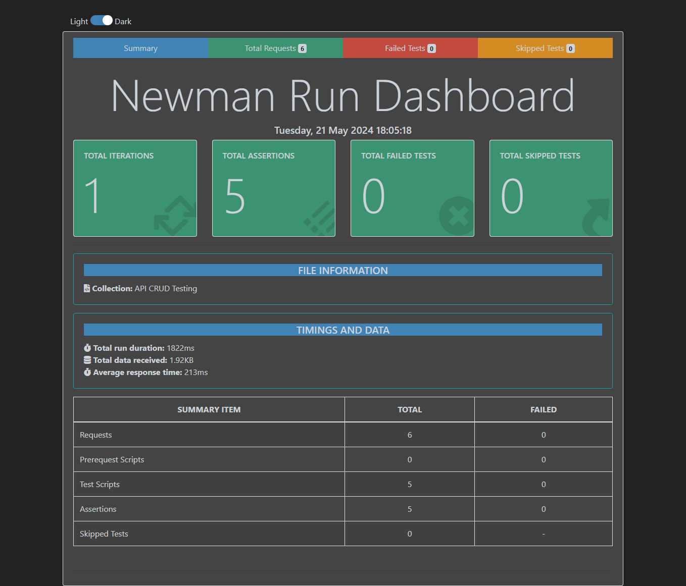

# API Testing Project: Reqres.in


Welcome to the API Testing project for Reqres.in! This project involves comprehensive testing of the Reqres.in API using Postman and Newman, focusing on CRUD operations and assertions.

## Table of Contents 📖 

- [Project Overview](#project-overview)
- [Key Features](#key-features)
- [Project Structure](#project-structure)
- [Screenshots](#screenshots)
- [How to Run the Tests](#how-to-run-the-tests)
- [Contact](#contact)

## Project Overview 🎯 

This project demonstrates API testing on the Reqres.in test site. It includes:
- Performing CRUD (Create, Read, Update, Delete) operations.
- Adding assertions to validate API responses.
- Generating detailed HTML reports using Newman.

## Key Features 🌟 

- **CRUD Operations**: Comprehensive tests for creating, reading, updating, and deleting users.
- **Assertions**: Validations to ensure API responses meet expected criteria.
- **Automated Reports**: Detailed HTML reports generated by Newman.

## Project Structure 📂

```plaintext
Project-2 (API Testing)/
├── API_CRUD_Testing.postman_collection.json/
├── Newman_Report/
│   └── Report.html
├── screenshots/
│   └── report_screenshot.png
├── README.md
```
## How to Run the Tests 🚀 
Prerequisites
- **Postman**
- **Node.js (for running Newman)**
- **Newman**

### Steps

1. **Clone the Repository**

    ```sh
    [git clone https://github.com/khalakuzamanrony/Software-Testing-Projects.git]
    cd Project-2(API Testing)
    ```

2. **Run the Postman Collection with Newman**

    ```sh
    newman run API_CRUD_Testing.postman_collection.json -r html --reporter-html-export Newman_Report/Report.html
    ```

3. **View the Report**

    Open `Newman_Report/Report.html` in your web browser.

## Screenshot



## Contact

- **Email**: [khalekuzzamanrony3@gmail.com](mailto:khalekuzzamanrony3@gmail.com)
- **LinkedIn**: [LinkedIn](https://www.linkedin.com/in/khalekuzzamanrony/)
- **GitHub**: [GitHub](https://github.com/khalakuzamanrony/)

---

*Maintained by [Khalekuzzaman Rony](https://github.com/khalakuzamanrony).*
